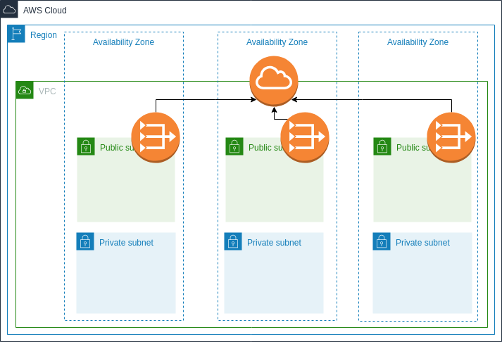

# Plantilla Terraform - VPC

[](https://travis-ci.org/punkerside/terraform-aws-template-vpc)
[](https://github.com/punkerside/terraform-aws-template-vpc/issues)
[](https://github.com/punkerside/terraform-aws-template-vpc/tags/)
[](https://opensource.org/licenses/Apache-2.0)



Amazon Virtual Private Cloud (Amazon VPC) le permite lanzar recursos de AWS en una red virtual que haya definido. Dicha red virtual es prácticamente idéntica a las redes tradicionales que se utilizan en sus propios centros de datos, con los beneficios que supone utilizar la infraestructura escalable de AWS.

## Recursos AWS

Esta plantilla de Terraform, despliega los siguientes recursos:

* Virtual Private Cloud
* Subnet
* Internet Gateway
* NAT Gateway
* Elastic IP Addresses
* Route Table

## Prerequisite

* [Instalar Terraform](https://learn.hashicorp.com/terraform/getting-started/install.html)
* [Instalar AWS CLI](https://docs.aws.amazon.com/cli/latest/userguide/cli-chap-install.html)
* Crear bucket S3 con el siguiente formato: **owner**-prod-terraform

**NOTA:** Al crear el bucket "**owner**" debe ser cambiado por el nombre del propietario del proyecto.

## Inicio rapido

Para desplegar toda la infraestructura:

```bash
make quickstart
```